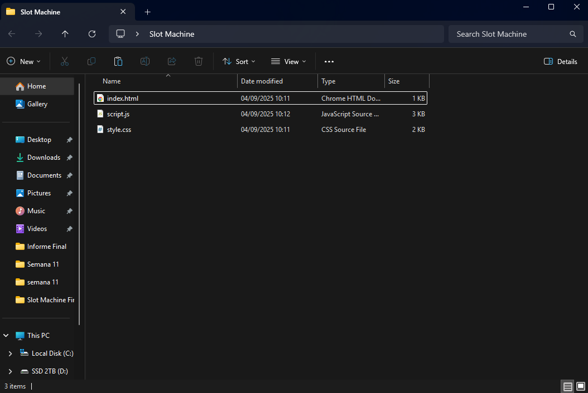
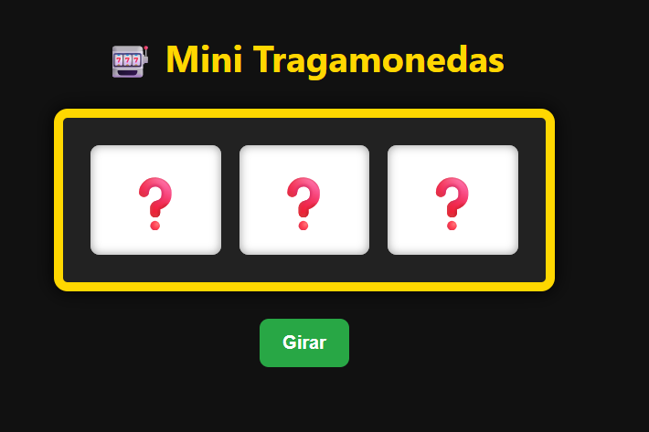
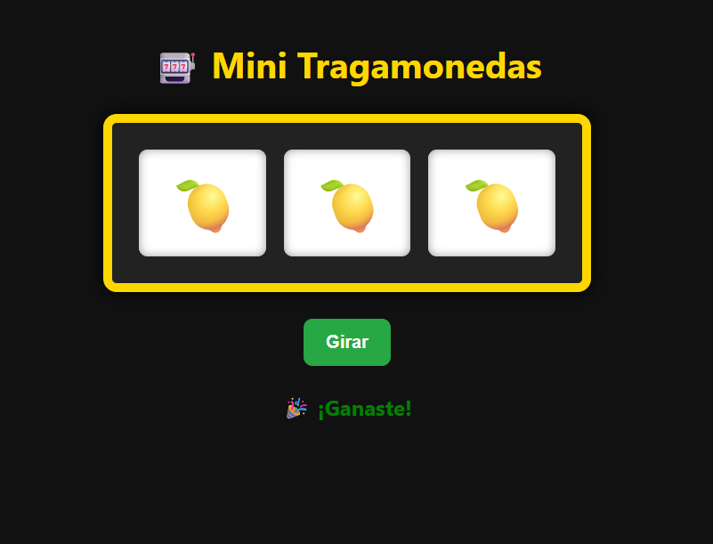

# 🎰 Mini Tragamonedas - Guía paso a paso (HTML + CSS)

Este proyecto simula una tragamonedas básica usando solo HTML y CSS.  
El JavaScript se agregará en la siguiente clase para que aprendamos a controlar la lógica del juego paso a paso.

---

## 📁 1. Crear una carpeta para el proyecto

Primero, crea una nueva carpeta en tu computador donde guardarás los archivos del proyecto:

```
MiniTragamonedas/
```

---

## 📄 2. Crear el archivo `index.html`

Dentro de la carpeta, crea un archivo nuevo llamado `index.html`.  
Este archivo será la **estructura base del sitio web**.

### Contenido de `index.html`:

```html
<!DOCTYPE html>
<html lang="es">
<head>
  <meta charset="UTF-8">
  <title>Mini Tragamonedas</title>
  <link rel="stylesheet" href="style.css">
</head>
<body>

  <h1>🎰 Mini Tragamonedas</h1>

  <!-- Área donde se mostrarán los tres símbolos -->
  <div id="slots">
    <span id="slot1">❓</span>
    <span id="slot2">❓</span>
    <span id="slot3">❓</span>
  </div>

  <!-- Botón para iniciar el juego (todavía no funcional sin JS) -->
  <button>Girar</button>

  <!-- Aquí irá el mensaje del resultado (en la próxima clase) -->
  <p id="mensaje"></p>

  <!-- Script se agregará en la próxima clase -->
  <!-- <script src="script.js"></script> -->

</body>
</html>
```

---

## 🎨 3. Crear el archivo `style.css`

Ahora crea un segundo archivo llamado `style.css` en la misma carpeta.  
Este archivo se encargará del **diseño visual de la página**.

> 🧠 **Nota**: Muchas propiedades de CSS como `padding`, `font-size`, `color`, `margin`, etc. se repiten en distintos bloques porque se usan para ajustar el tamaño, el espacio o el color de distintos elementos visuales.

### Contenido de `style.css` con explicación:

```css
/* Estilos generales del cuerpo de la página */
body {
  font-family: 'Segoe UI', sans-serif; /* Fuente moderna y fácil de leer */
  background-color: #111;              /* Fondo oscuro como en un casino */
  color: white;                        /* Texto en color blanco para contraste */
  text-align: center;                  /* Todo el texto centrado */
  padding: 40px;                       /* Espacio interior para que no quede pegado al borde */
}

/* Estilo del título principal */
h1 {
  font-size: 40px;         /* Tamaño grande del título */
  margin-bottom: 30px;     /* Espacio inferior con respecto al contenido siguiente */
  color: #ffd700;          /* Color dorado (hexadecimal) */
}

/* Contenedor de los símbolos (los 3 carretes) */
#slots {
  display: flex;                   /* Usa flexbox para alinear en fila */
  justify-content: center;        /* Centrado horizontal */
  gap: 20px;                       /* Espacio entre cada símbolo */
  background-color: #222;         /* Fondo más claro que el body */
  padding: 30px;                  /* Relleno interno del recuadro */
  border: 10px solid #ffd700;     /* Borde dorado grueso */
  border-radius: 15px;            /* Esquinas redondeadas */
  box-shadow: 0 0 20px #000;      /* Sombra alrededor */
  width: fit-content;             /* Tamaño justo para su contenido */
  margin: 0 auto 30px auto;       /* Centrado horizontal + separación inferior */
}

/* Estilo de cada símbolo (span individual) */
#slots span {
  background-color: white;       /* Fondo blanco para el emoji */
  color: black;                  /* Emoji en color oscuro */
  font-size: 60px;               /* Tamaño grande del emoji */
  padding: 20px 30px;            /* Relleno vertical y horizontal */
  border-radius: 10px;           /* Bordes redondeados */
  box-shadow: inset 0 0 10px #999; /* Sombra interna para efecto de profundidad */
}

/* Estilo del botón */
button {
  padding: 15px 25px;           /* Relleno interior del botón */
  font-size: 20px;
  font-weight: bold;
  background-color: #28a745;    /* Verde llamativo */
  border: none;                 /* Sin borde */
  color: white;                 /* Texto en blanco */
  border-radius: 10px;
  cursor: pointer;             /* Cursor de mano al pasar por encima */
}

/* Efecto al pasar el mouse por el botón */
button:hover {
  background-color: #218838;    /* Verde más oscuro */
}

/* Estilo del mensaje que aparece al final */
#mensaje {
  font-size: 24px;
  font-weight: bold;
  margin-top: 30px;
}
```

---

## 🔍 4. Verifica que tu estructura sea así:

```
MiniTragamonedas/
├── index.html
├── style.css
└── (script.js ← lo crearemos más adelante)
```

---

### 🗂️ Estructura de la carpeta (refuerzo visual)
*Así debería verse la carpeta de tu proyecto después del paso 4:*




## 📦 5. Cómo visualizar el proyecto

- Abre la carpeta en tu computador.
- Haz doble clic en el archivo `index.html` para abrirlo en tu navegador.
- Verás el diseño de la tragamonedas con símbolos "❓" y un botón que por ahora **no hace nada**.

---

## 🚀 Próxima clase

En la próxima clase vamos a:

- Crear el archivo `script.js`
- Hacer que los íconos giren
- Detectar si ganas o pierdes
- Agregar animaciones básicas con JavaScript

---

## ✏️ Autor

Este proyecto fue creado con fines educativos para practicar HTML y CSS.  
La lógica del juego será programada por los estudiantes en las siguientes clases.

---

## 🖼️ Vista previa del proyecto

### 🎰 Antes de girar (Vista inicial)


### 🎉 Después de girar (cuando se agregue JavaScript)
